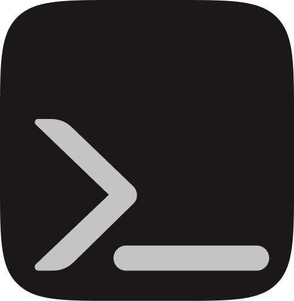

#goCLI

{ width="100px" align="left" }
A simple and lightweight cli framework for go applications. Get your cli setup in seconds.


[](https://pkg.go.dev/github.com/LucasCarioca/gocli)
[](https://goreportcard.com/report/github.com/LucasCarioca/gocli)

## Getting started

Add the dependency `go get github.com/LucasCarioca/gocli`

Your first cli

```go
package main

import "github.com/LucasCarioca/gocli/cli"

func main() {
    app := cli.NewApp(func() error {
        fmt.Println("Hello world")    	
    })
    app.Run()
}
```

Build and run

```shell
go build main.go -o mycli
mycli
# Hello World
```


